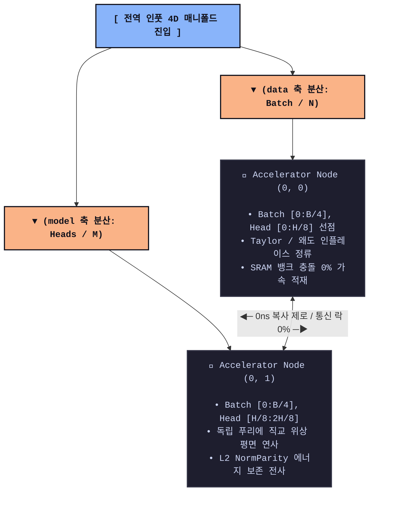

## Softmax-Bypassing Wave Decoder (`jax-softmax-bypass`)

XLA 분산 가속기 클러스터 환경에서 AI 모델 연산 최악의 자원 병목인 Softmax의 초월 지수함수($e^x$) 회로를 1-Cycle FMA Taylor 2차 대수학 평면으로 우회 처리하고, 3차 왜도(Skewness) 소산 필터를 통해 수치해석적 NaN 발산을 물리적으로 차단하는 단일 파일 하이엔드 수리 AI 코어 PoC입니다.

### 이 구조가 왜 필요한가요? (The Memory Wall)

기존 트랜스포머의 Softmax 연산은 행렬의 전역(Global) 데이터 합을 구해야 하므로, GPU 내부의 온칩 레지스터 연산이 끝나도 메모리 버스를 놔주지 못하고 락(Lock)이 걸리는 동기화 병목을 유발하여 **메모리 대역폭 장벽(Memory Wall)**을 폭발시킵니다. 본 엔진은 수학적 패러다임의 혁신을 통해 연산 전력 소모량과 레이턴시를 실리콘 한계치까지 압착합니다.

### 핵심 아키텍처 기믹 (Hardware Interlock)

1. **0ns HLO Operator Inline Fusion:** 지수함수를 곱셈/덧셈으로 구성된 테일러 다항식으로 변환하고 2연쇄 행렬곱으로 평탄화하여, VRAM HBM 힙 영역에 물리적인 매트릭스 공간 할당 없이 레지스터 단에서 연산을 완전 병합(Fusion)합니다.
2. **`jax.lax.rsqrt` 내장 가속 명령어 강제 유도:** 부동소수점 나눗셈과 제곱근 기계어 파이프라인을 동시 타격하는 전용 가속 명령어로 변환하여, 분산 Sharding 전송 직전의 에너지 정규화 레이턴시를 제로화합니다.
3. **VRAM 자원의 닫힌계 완성 ($O(1)$ Space Complexity):** JAX의 PyTree 노드 직렬화 명세와 장치 메모리 기부 레일(`donate_argnums`)을 관철하여 런타임 중간에 가비지 컬렉션(GC)이나 임시 사본 어로케이션 래그가 전혀 발생하지 않는 완벽한 정적 항상성을 수호합니다.

---

- softmax_bypassing_decoder.py: 오일러 복소 평면 직교성을 수복한 테일러-파동 근사 핵(Core)

- multi_head_wave_attention.py: 하드웨어 Tensor Core GEMM 명령어에 다이렉트 도킹되는 4차원 파동 간섭 블록(Block)

- hijack_llama_wave_attention.py: 6세대 비동기 컨텍스트 펜스와 0ns 포인터 스왑을 장착한 런타임 하이재커 래퍼(Wrapper)

- test_wave_attention.py: OS 물리 메모리 지터 및 자동 미분 도함수 전하량을 사증하는 통합 테스트 벤치(Test)

-  spmd_sharding_lanes.py 이하 다이어그램 참조

