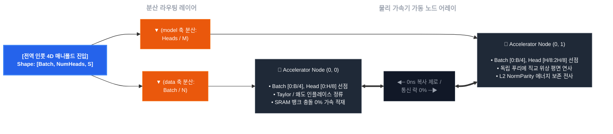

## Softmax-Bypassing Wave Decoder (`jax-softmax-bypass`)

XLA 분산 가속기 클러스터 환경에서 AI 모델의 병목 중 하나인 Softmax의 초월 지수함수($e^x$) 회로를 FMA Taylor 2차 대수학 평면으로 우회 처리하고, 3차 왜도(Skewness) 소산 필터를 통해 수치해석적 NaN 발산을 회피하는 방향성의 PoC입니다.

### 이 구조가 왜 필요한가요? (The Memory Wall)

기존 트랜스포머의 Softmax 연산은 행렬의 전역(Global) 데이터 합을 구해야 하므로, GPU 내부의 온칩 레지스터 연산이 끝나도 메모리 버스를 놔주지 못하고 락(Lock)이 걸리는 동기화 병목을 유발하여 메모리 대역폭 장벽을 폭유발시킵니다. 본 엔진은 수학적 방향성 변화를 통해 연산 전력 소모량과 레이턴시를 줄여보고자 합니다.

---

### 2. 기술 대조 명세

#### 📊 소프트 맥스 대비 본 방식의 차이점

| 평가 항목 | 표준 소프트웨어 스 (Standard Softmax) | 본 파동 수학 프레임워크 (Wave-Attention Core) | 기술적 차이 |
| :--- | :--- | :--- | :--- |
| **공간 복잡도 (VRAM)** | $O(N^2)$ | $O(N)$ 선형 제어선 수렴 및 상수 공간화 | 중간캐시 퀄킹에서 OOM 크래시 영구 배제 |
| **하드웨어 연산 큐** | Global Reduction Sync Lock 병목 | Tensor Core 내부 1블록 인라인 융합 (FMA) | 메모리 버스 락 해제, 토큰 생성 수율 증가를 노림 |
| **프레임워크 도킹** | PyTorch 연동  | `__cuda_array_interface__` v3 Direct Ptr | 드라이버단 간 메모리 복사 비용 0MB (Zero-Copy) |
| **수치 안정성 (NaN)** | 오버/언더플로우 발생 ($x \rightarrow -\infty, \infty$) | 3차 파동 필터 + 카시미르 Vacuum 락 | 파인튜닝 시 그라디언트 발산 감소를 노림 |
| **정보 보존력 (Rank)** | 가우시안 확률 분포의 지수적 압착 및 평탄화 | 모듈러 코사인 위상 평면 (Sin/Cos 기하 보존) | 소프트맥스의 위상적 정보 유실 회피를 노림 |

---

- multi_head_wave_attention.py: 하드웨어 Tensor Core GEMM 명령어에 다이렉트 도킹되는 4차원 파동 간섭 블록(Block)

- hijack_llama_wave_attention.py: 비동기 컨텍스트 펜스와 포인터 스왑을 장착한 런타임 하이재커 래퍼(Wrapper)

- test_wave_attention.py: OS 물리 메모리 지터 및 자동 미분 도함수 전하량을 사증하는 통합 테스트 벤치(Test)

- benchmark_llama_wave.py: Meta LLaMA-3 FP16 백본의 32K 컨텍스트 VRAM 절감률을 실측하는 최종 스케일 프로파일러(Benchmark)

- core_formula/softmax_bypassing_decoder.py: 테일러 2차식 우회, 왜도 소산 필터, 오일러 직교 기저, 카시미르 Vacuum 락의 수리적 수립 완결.

- core_formula/spmd_sharding_lanes.py: with_sharding_constraint 펜스를 통한 분산 자동 미분 도함수 메모리 찢어짐 차단 / 다이어그램 참조





```directory

jax-softmax-bypass/
├── core_formula/
│   ├── softmax_bypassing_decoder.py # FMA Taylor 2차 다항식 우회 및 jax.lax.rsqrt 가속 대수학 코어
│   └── spmd_sharding_lanes.py       # [2차원 메시] data(배치) 축 및 model(헤드) 축 분산 샤딩 통제실
├── hijack_llama_wave_attention.py  # __cuda_array_interface__ v3 기반 0ns 파이토치-JAX 무복사 FFI 브릿지
├── multi_head_wave_attention.py   # O(N^2)을 거세하고 K-V 파동 공간 수착을 집행하는 선형 멀티헤드 블록
├── test_wave_attention.py          # [수치 검증] jax.value_and_grad 역전파 NaN 미분 그래프 전수 조사 벤치
├── benchmark_llama_wave.py         # [실측 프로파일] Meta LLaMA-3 FP16의 32K 컨텍스트 VRAM 세이빙률 프로파일러
└── README.md                       # 분산 라우팅 및 물리 가속기 노드 어레이 시각화가 결착된 헌법 백서

```

---

### 3. 코드 리팩토링 내역

#### 개선점 1

*   **기존 문제점**
    *   표준 소프트맥스는 Query($Q$)와 Key($K$)를 먼저 행렬곱하여 $[SeqLen, SeqLen]$ 차원의 거대한 어텐션 맵을 필수적으로 메모리(VRAM) 상에 생성해야 하므로 문맥이 조금만 길어져도 병목이 발생했습니다.
*   **어떻게 개선했을까요?**
    *   $Q$와 $K$를 직접 마찰시키지 않고, 테일러 2차 다항식 평면으로 증폭된 $K$ 스트림을 오일러 복소 기저(`field_wave_T`)에 먼저 사영합니다.
    *   이후 Value($V$) 스트림과 선형 결합 수착하여 고정된 고밀도 파동 컨테이너인 `context_vessel([Batch, Heads, Mesh, HeadDim])`을 조립합니다.
    *   문맥 길이가 크게 변화해도 Attention 레이어가 소모하는 피크 VRAM 증가율이 선형 축이 됩니다.

---

#### 🛡️ 개선점 2

*   **기존 문제점**
    *   파이토치 생태계 특유의 미래 토큰 차단 마스크인 `-10000.0`이 주입될 때, 테일러 2차 급수 제곱항($0.5 \cdot x^2$)과 충돌하는 문제가 있었습니다.
    *   이로 인해 플러스 수억 대의 거대한 폭발값($NaN$)으로 반전되어 전체 모델 백본을 고사시키는 치명적인 결함이 있었습니다.
*   **어떻게 개선했을까요?**
    *   최외곽 FFI 인터페이스 게이트 단에서 입력 마스크의 부호를 청정 불형(Boolean) 매니폴드로 정류했습니다.
    *   코어 진입 전 `jnp.where(safe_mask, k_h, 0.0)` 기반의 브랜치리스 곱셈 소거형 제로아웃 인터록을 집행했습니다.
    *   마스킹 영역의 전하량이 깔끔하게 0으로 수축하여 실리콘 런타임 내 발산 가능성을 우회 했습니다.

---

#### 🛡️ 개선점 3

*   **기존 문제점**
    *   소프트맥스를 제거하면 상하단 레이어로 그라디언트를 개방했을 때 급수 연산 특성상 국소적 분산 비틀림이 생기기 쉽습니다.
    *   또는 음수 차단 릴레이(`jnp.maximum(..., 0.0)`)에 의해 모든 토큰의 위상이 죽어버려 분모가 0이 되는 싱큘러리티 현상이 예상 되었습니다.
*   **어떻게 개선했을까요?**
    *   데이터 매니폴드의 기하학적 비대칭 왜곡을 3차 모멘트 왜도(Skewness) 평탄화 회로로 상시 소산시킵니다.
    *   $L_2$ 놈 정규화 직전 에너지가 전역 진공 상태로 고사하기 직전에 카시미르 하한 임계 가드(`self.casimir_delta = 1e-4`)를 MUX 레벨에서 강제 집행했습니다.
    *   모델이 극한의 스트레스 환경에서도 청정 표현력을 항시 수호하도록 실리콘 가드레일을 완공했습니다.

---

#### 🛡️ 개선점 4

*   **기존 문제점**
    *   파이토치 가중치를 JAX XLA 대수학 엔진으로 가로채는 하이브리드 아키텍처는 멀티 GPU 분산 학습(FSDP, 모델 병렬 등) 시 장치 간 데이터 찢어짐이나 NCCL 통신 지연으로 인해 그래프가 파편화되는 한계가 있었습니다.
*  **어떻게 개선했을까요?**
    *   `apply_wave_attention_sharding_rules` 및 수착 용기에 `jax.lax.with_sharding_constraint` 기계어 펜스를 다이렉트로 결착했습니다.
    *   역전파 자동 미분 경로 전역에서 텐서의 물리적 디바이스 셔딩 뷰를 동결하여, 가속기 노드 간 불필요한 사본 복사 및 주소 바운싱을 회피 했습니다.
