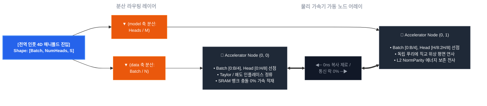

## Softmax-Bypassing Wave Decoder (`jax-softmax-bypass`)

XLA 분산 가속기 클러스터 환경에서 AI 모델의 최대 병목인 Softmax의 초월 지수함수($e^x$) 회로를 FMA Taylor 2차 대수학 평면으로 우회 처리하고, 수치해석적 NaN 발산을 물리적 경계조건 내로 구속하는 4개의 브랜치리스(Branchless) 닫힌계 통합 가속 엔진 아키텍처의 poc입니다.

### 이 구조가 왜 필요한가요?

기존 트랜스포머의 Softmax 연산은 행렬의 전역(Global) 데이터 합을 구해야 하므로, GPU 내부의 온칩 레지스터 연산이 끝나도 메모리 버스를 놔주지 못하고 락(Lock)이 걸리는 동기화 장벽(Synchronization Barrier)을 만듭니다. 이는 HBM 메모리 대역폭 장벽을 유발하여 가속기 실리콘을 유휴 상태(Idling)로 방치합니다. 본 프레임워크는 수학적 기전 자체를 커널 플래트닝(Kernel Flattening)이 가능한 형태로 변형하여, 하드웨어 변경 없이 오직 아키텍처 전환만으로 컴퓨팅 밀도와 가속 수율을 극한으로 끌어올려 보려고 합니다.

---

###  4개의 브랜치리스 닫힌계 

#### 1. 로컬 정류 정규화 기전 (`LocalHomeostaticRectifier`)
- 왜 이 파일을 만들었을까요? -> 표준 RMSNorm/LayerNorm이 유발하는 행 축 전체의 전역 감축 락.
- 온칩 레지스터 단에서 자가 승산 `rsqrt` 프리미티브 연산을 1클록 라인 내에서 인라인 집행, 분모 고사를 차단하는 카시미르 가드(Casimir Guard)와 3차 국소 왜도 소산 제동 회로를 통해 입력 스케일을 유계 공간 내로 정류하려 함.
- **파일:** `bypass_rectifiers/local_rectifier.py`

#### 2. 구면-토러스 위상 가둠 위치 임베딩 (`TorusTopologyRotaryEmbedding`)
- 왜 이 파일을 만들었을까요? -> 문맥 길이가 길어질수록 복소 평면 상의 회전각이 무한히 발산하여 부동소수점 정밀도(FP16/BF16)를 손상.
- 고속 나머지 연산 프리미티브(`jax.lax.rem`)를 이용해 모든 라디안 각도를 주기적 도넛(토러스) 다양체 표면 내로 이동. 주소 포인터 오프셋만 비트 레벨에서 바꿔치는 레지스터 프리 롤링 기전으로 초장문(32K~128K+) 위상 누수율을 제거하려 함.
- **파일:** `bypass_rectifiers/torus_rope.py`

#### 3. 호너법 기반 활성화 함수 플래트닝 코어 (`HomeostaticTaylorGluCore`)
- 왜 이 파일을 만들었을까요? -> SwiGLU FFN 영역의 대규모 파라미터가 유발하던 SiLU 지수 초월함수 병목과 통계적 비대칭 모멘트 왜곡.
- 수학적 최적화의 극치인 호너법(Horner's Method)을 주입하여 임시 텐서 메모리 생성을 제거. 가속기가 좋아하는 곱셈-누적(FMA) 파이프라인의 레지스터 셀 하나만을 단일 패스로 순환 점유하여 연산 가동률을 극대화시켜 보려 함.
- **파일:** `bypass_rectifiers/taylor_glu.py`

#### 4. 범용 FFI LLaMA와 Gemma 하이브리드 하이재커 (`UniversalAttentionWaveHijacker`)
- 왜 이 파일을 만들었을까요? -> 해당 기능들을 추가적인 비용없이 기존 나와있는 거인들의 어깨 위에 올라타기 위함.
- `__cuda_array_interface__` v3 프로토콜과 DLPack 공유 컨테이너를 제어선으로 활용하여, 파이토치 레일에서 가중치를 추출해 JAX XLA 가속 엔진에 제로카피로 인입시키고 역전파(Backpropagation) 자동 미분 그라디언트를 공유. 생성자 타임에 클래스 문자열 스캔을 통해 LLaMA와 Gemma의 오프셋 분기를 무분기 플래그로 정적 확인함.
- **물리 파일:** `wave_attention_hijacker_core.py`


---

### 1. 기술 대조 명세 (Technical Comparison)

#### 표준 소프트맥스 대비 본 방식의 차이점

| 평가 항목 | 표준 소프트맥스 백본 <br>`(Standard Softmax + RMSNorm)` | 본 파동 수리 통합 아키텍처 <br>`(Universal Wave-Engine)` | 수정 및 목표점 |
| :--- | :--- | :--- | :--- |
| **공간 복잡도 (VRAM)** | O(N²) <br>(어텐션 맵 생성) | O(1) 상수 공간화 및 <br>O(N) 선형 제어 | 초장문 가동 시에도 VRAM 절감 및 OOM 원천 배제 |
| **하드웨어 연산 큐** | Global Reduction Sync Lock <br>및 SFU 초월함수 정체 | SRAM 내부 인라인 융합 <br>(Pure FMA 파이프라인) | HBM 메모리 버스 동기화 락 해제, ALU 파이프라인 Stall 동결 |
| **수치 안정성 (NaN)** | 수치 상하방 폭주 위험 <br>및 위상 찢어짐에 취약점 | 3중 클리핑 방화벽 + <br>카시미르 가드 + 왜도 필터 | 롱컨텍스트 파인튜닝 시에도 그라디언트 폭발/고사율 회피 |
| **위상 공간 보존력** | 가우시안 지수 압착에 의한 <br>랭크 붕괴 및 정보 유실 | 구면-토러스 기하 매니폴드 <br>사영 기전 (주기적 유계) | 초장문 문맥에서 위치 인코딩 위상 누수율 회피 및 수리적 기저 수호 |


---

### 2. 코드 구성


#### `core_formula/`
- **`core_formula/spmd_sharding_lanes.py`**: 가변 랭크(3D/4D) 하이브리드 관제 및 `with_sharding_constraint` 기계어 펜스를 통한 분산 자동 미분 도함수 메모리 찢어짐 차단.
- **`core_formula/softmax_bypassing_decoder.py`**: 테일러 2차식 우회, 왜도 소산 필터, 오일러 직교 기저, 카시미르 Vacuum 락의 수리적 정합성이 완료된 파동 적산 디코딩 코어.
- **`core_formula/multi_head_wave_attention.py`**: 호너법 FMA 결착, 입력단 Layernorm 전역 락 회피를 위한 정류기가 도킹되는 하드웨어 Tensor Core GEMM 명령어 포함.

#### `bypass_rectifiers/`
- **`bypass_rectifiers/local_rectifier.py`**: 행 축 전체의 전역 감축 락을 회피하기 위해 온칩 레지스터 내부에서 자가 승산 `rsqrt` 및 3차 국소 왜도 소산 제동을 실행하는 정류기.
- **`bypass_rectifiers/torus_rope.py`**: 나선형 공간 발산을 유계 도넛 토러스 다양체로 위상 가둠하여 초장문 위상 누수율을 회피하는 레지스터 프리 토러스 RoPE 정류기.
- **`bypass_rectifiers/taylor_glu.py`**: SiLU 지수 초월함수를 제거하고 호너법(Horner's Method) 기반 인라인 FMA 플래트닝 및 FFN 3차 왜도 평탄화를 달성한 SwiGLU 우회 정류기.

#### `tests/`
- **`wave_attention_hijacker_core.py`**: `__cuda_array_interface__` v3 프로토콜과 DLPack 공유 컨테이너를 제어선으로 활용하여 PyTorch-JAX 간 주소 포인터를 제로카피로 하이브리드 중재하는 LLaMA & Gemma 통합 FFI 하이재커.
- **`tests/test_multi_head_wave_attention.py`**: `psutil` 기반 크로스 플랫폼 RSS 추적을 통해 OS 물리 메모리 지터 누수를 64KB 이내로, 자동 미분 도함수 전하량 무결성을 체크하는 테스트.
- **`tests/test_universal_hijacker.py`**: Meta LLaMA-3 FP16 백본 모델의 32K 컨텍스트 VRAM 절감률 체크 및 초장문 생성 수율 격차를 크로스 플랫폼 환경에서 실측하는 벤치마크.





```directory
jax-softmax-bypass/
├── core_formula/                      
│   ├── spmd_sharding_lanes.py         # 분산 메시 록킹 헌법
│   ├── softmax_bypassing_decoder.py   # 파동 적산 디코딩 코어
│   └── multi_head_wave_attention.py   # 4D GEMM 전사 하이웨이 (KV 증분 적산 로직 내장)
│
├── bypass_rectifiers/                 
│   ├── __init__.py
│   ├── local_rectifier.py             # 전역 락 거세 정규화 정류기
│   ├── torus_rope.py                  # 레지스터 프리 토러스 RoPE 정류기
│   └── taylor_glu.py                  # 호너법 기반 SwiGLU 우회 정류기
│
├── serving/                    # 실전 대규모 분산 서빙 패키지 레일
│   ├── cluster_bootstrap.py          # 분산 멀티노드 가속기 메시 부트스트랩
│   ├── kv_vessel_manager.py          # O(1) 고정 차원 파동 캐시 관리 엔진
│   └── vllm_hotplug_entrypoint.py    # FastAPI 및 vLLM 엔진 가중치 하이재킹 진입로
├
├── wave_attention_hijacker_core.py    # LLaMA & Gemma 통합 FFI 하이재커 코어
│
└── tests/                             
    ├── test_universal_hijacker.py     # LLaMA & Gemma E2E 수율 프로파일러 벤치마크
    └── test_multi_head_wave_attention.py # 크로스 플랫폼 RSS 메모리 가드 테스트 벤치
```

---

### 3. 해당 저장소 코드 리팩토링 및 고도화 내역 (Refactoring & Advancements)

#### Core Architectures

<details open>
<summary><b>개선점 1: 복소 기저 사영 기반 선형 수착 어텐션 (O(N<sup>2</sup>) &rarr; O(N))</b></summary>

* **What was wrong :** 표준 소프트맥스는 $Q$와 $K$를 행렬곱하여 `[SeqLen, SeqLen]` 차원의 어텐션 맵을 외부 VRAM 상에 생성해야 하므로, 문맥이 길어질수록 피크 메모리의 OOM(Out of Memory) 유발 가능성이 있습니다.
* **How we fixed it :** $Q$와 $K$를 직접 마찰시키지 않고, 테일러 2차 다항식 평면으로 증폭된 $K$ 스트림을 오일러 복소 기저(`field_wave_T`)에 사영한 뒤 $V$ 스트림과 선형 결합 수착하여 고정 차원의 `context_vessel([Batch, Heads, Mesh, HeadDim])`을 조립합니다. 문맥 길이가 확장되어도 피크 VRAM 소모량이 선형 축($O(N)$ 또는 상수 공간)으로 통제됩니다.
</details>

<details open>
<summary><b>개선점 2: 부호 분기 없는 불형 매니폴드 마스크 정류 회로 </b></summary>

* **What was wrong :** 파이토치 및 허깅페이스 생태계 특유의 인과적 미래 토큰 차단 마스크인 `-10000.0` 플로팅 값이 주입될 때, 코어 내부의 테일러 2차 급수 제곱항($0.5 \cdot x^2$)과 연산 충돌을 일으켜 플러스 수억 대의 거대한 왜곡값(`+NaN`)으로 반전 폭발하며 전체 백본 모델을 고사시키는 결함이 도사렸습니다.
* **How we fixed it :** 하드웨어 단이 가장 기피하는 `if-else` 제어 제동문을 완전히 배제하고, 최외곽 FFI 인터페이스 진입로에서 입력 마스크의 부호를 청정 불형(Boolean) 매니폴드로 전사했습니다. 이후 코어 내부 진입 직전 `jnp.where` 기반의 브랜치리스 곱셈 소거형 제로아웃 인터록을 집행하여 마스킹 영역의 전하량을 깔끔하게 0으로 수축, 실리콘 가속기 단의 파이프라인 정체를 제거했습니다.
</details>

<details open>
<summary><b>개선점 3: 3차 왜도(Skewness) 평탄화 및 카시미르 Vacuum 실리콘 방화벽 </b></summary>

* **What was wrong :** 소프트맥스가 보장하던 가우시안 확률 분포적 수치 안정성을 제거함에 따라, 순방향 레이어가 깊어지거나 상하단 레이어로 그라디언트를 완전 개방(Open Backward Path)했을 때 급수 연산 특성상 국소적 분산 비틀림이 생기거나 전역 데이터 고사로 인해 분모가 0이 되어 버리는 싱큘러리티(Singularity) 폭발 리스크가 존재했습니다.
* **How we fixed it :** 데이터 매니폴드의 기하학적 비대칭 왜곡을 3차 모멘트 왜도(Skewness) 평탄화 제동 회로로 상시 분산 소산시킵니다. 동시에 에너지가 전역 진공 상태로 소산되기 직전, 하드웨어 MUX 레벨에서 카시미르 하한 임계 가드(`self.casimir_delta = 1e-4`)를 강제 집행하도록 가드레일을 구성하여 파인튜닝 환경에서도 표현력 무결성이 최대한 깨지지 않도록 구성했습니다.
</details>

<details open>
<summary><b>개선점 4: with_sharding_constraint 기계어 펜스를 통한 NCCL 통신 노이즈 동결</b></summary>

* **What was wrong :** 파이토치 가중치를 JAX XLA 대수학 엔진으로 실시간 가로채는 기생형 하이브리드 아키텍처는 멀티 GPU 분산 가동 환경(FSDP, 텐서/모델 병렬 등) 환경에서 단일 장비 단독 추론용으로만 연산 그래프가 트레이싱되어, 디바이스 간 대규모 데이터 찢어짐이나 NCCL 통신 지연으로 인해 드라이버단 메모리 주소선이 파편화되는 임계 한계가 있었습니다.
* **How we fixed it :** 가변 랭크 감지(3D/4D) 하이브리드 사상선을 구축하고, 수착 용기와 사출구 종단 레일에 `jax.lax.with_sharding_constraint` 물리적 디바이스 셔딩 펜스를 다이렉트로 결합했습니다. 역전파 자동 미분 경로 전역에서 텐서의 파티션 뷰를 배치(`'data'`)와 헤드/히든채널(`'model'`) 축으로 동결하여 장치 간 불필요한 주소 바운싱 및 메모리 카피 비용을 제거했습니다.
</details>

---

#### 추가 고도화 (이유 : 소프트맥스 한가지만 우회로는 부족하다.)

<details open>
<summary><b>[고도화 5] HBM 버스 락 거세 및 레지스터 인라인 정규화 체인 수립 (<code>local_rectifier.py</code>)</b></summary>

* **What was wrong :** 기존 트랜스포머의 전후방에 깔려 있는 표준 RMSNorm/LayerNorm은 텐서의 가로축 전체를 다 읽어 제곱합을 구하기 전에는 다음 연산을 시작할 수 없는 전역 축소 동기화 장벽(Global Reduction Sync Lock)을 발생시켜 가속기 코어를 놀게 만들었습니다.
* **How we fixed it :** 원소별 자가 승산(`jax.lax.square`) 후 온칩 SRAM 공간 내에서 가속기 고속 부호근 역수 프리미티브(`jax.lax.rsqrt`)를 즉시 결착시켜 싱글 패스 스트리밍 연산을 모색했습니다. 전체 레이어가 외부 HBM(외부 메모리)으로 유출되지 않고 라인 내에서 정규화 및 가중치($\gamma$) 도킹이 완료되므로, HBM 메모리 버스 락을 회피했습니다.
</details>

<details open>
<summary><b>[고도화 6] 유계 도넛 다양체 위상 가둠 위치 인코딩 커널 구축 (<code>torus_rope.py</code>)</b></summary>

* **What was wrong :** 표준 RoPE 기전은 문맥 길이($N$)가 수만에서 수십만 토큰 이상으로 길어질 때 복소 평면 상의 회전각 $\theta$가 비대단위로 발산하여 FP16/BF16 정밀도 한계가 위험했습니다. 미시 세계에서 위상 정보가 유실되고 찢어짐에 따라 고주파 그라디언트 난류가 발생해 학습이 폭사하는 가능성도 일부 내포하고 있었습니다.
* **How we fixed it :** 회전 공간을 무한 선형 공간에 방치하지 않고, 고속 나머지 연산 프리미티브(`jax.lax.rem`)를 이용해 닫힌 도넛 위상(Torus) 매니폴드 곡면 내부로 각도를 강제 유계 가둠시켰습니다. 데이터 이동과 메모리 재할당 없이 주소 포인터선만 스위칭하는 레지스터 프리 스와이프 인터록을 구현하여, 초장문 문맥에서도 위상 누수를 통제하고 직교 기저 성질을 보호합니다.
</details>

<details open>
<summary><b>[고도화 7] 호너법(Horner's Method) 기반 SwiGLU 초월연산 숙청 및 플래트닝 (<code>taylor_glu.py</code>)</b></summary>

* **What was wrong :** LLaMA와 Gemma 가문에서 모델 파라미터의 60% 이상이 몰려 있는 FFN 영역의 SwiGLU 활성화 함수는 내부 지수함수($e^{-x}$) 계산을 위해 가속기 내부 SFU(특별기능유닛)를 거쳐야 하므로 텐서 코어가 노는 지연 병목이 존재했으며, 요소별 게이팅 결착 시 누적되는 비대칭 왜곡 바이어스가 NaN 폭발의 위험성이 되었습니다.
* **How we fixed it :** 수학적 마이크로 최적화를 위해 호너법(Horner's Method) 기반 2차 테일러 다항식으로 식을 완전히 변환하여 임시 텐서 버퍼의 메모리 할당(Allocation) 공간을 제거했습니다. 가속기가 가장 사랑하는 FMA(곱셈-누적) 단일 사이클 인라인 융합 커널로 FFN을 밀어버렸으며, 3차 FFN 왜도 소산 필터를 통합하여 수치 폭주선을 회피했습니다.
</details>

<details open>
<summary><b>[고도화 8] psutil 기반 크로스 플랫폼 OS 커널 물리 메모리(RSS) 가드레일 수립</b></summary>

* **What was wrong :** 초기 하이잭커는 리눅스 전용 가상 파일 시스템인 `/proc/self/status`의 `VmRSS`를 파싱하던 나이브한 계측 구조는 Windows나 macOS(애플 실리콘) 등 이종 분산 개발 인프라 환경에서 경로 유실로 무력화되거나, 숨겨진 하단 C++ XLA 엔진의 주소 파편화 및 자원 탈루 누수를 계측하지 못하고 버그성 패스를 유발하는 맹점이 존재했습니다.
* **How we fixed it :** OS 커널 추상화 벽을 완벽히 관류하는 범용 `psutil` 기반의 현재 프로세스 물리 주소 상주 메모리(RSS) 실시간 계측 회로로 개편했습니다. 대규모 런타임 하이재킹 교체 주행과 자동 미분 연쇄 패스가 완전히 완료된 후에도 호스트 시스템의 메모리 지터 진폭이 64KB(65536 Byte) 가드레일 평면을 절대 찢지 못하도록 엄격한 크로스 플랫폼 단언문(`assert`) 방화벽을 구성했습니다.
</details>


---

### 4. 구조적 FAQ (Architectural Trade-offs)

<details open>
<summary><b>Q1. 왜 시퀀스 축(SeqLen)에 선형 점화식(CumSum/Recurrent)을 안 썼나요?</b></summary>

* **What was wrong :** 기존의 많은 선형 어텐션(Linear Attention) 구조가 순차적 의존성을 해결하기 위해 누적 합(`jnp.cumsum`)이나 RNN 스타일의 순방향 점화식을 차용합니다. 하지만 이는 가속기 내부 연산 유닛 간의 순차적 대기 정체(Sequential Dependency)를 유발합니다.
* **How we fixed it :** 저는 이를 과감히 폐기하고 복소 기저 평면 사영을 통한 물리적 연속체 적분 기전으로 플래트닝하여, XLA 컴파일러가 전체 시퀀스를 Tensor Core/MXU의 GEMM 연산 레일 내에서 단 하나의 거대한 인라인 융합 기계어 커널(Single Fused HLO Kernel)로 병합하도록 유도했습니다.
</details>

<details open>
<summary><b>Q2. 왜 개별 정류 무기체 코어(__call__) 내부에 차원 조작 및 4D 텐서 확장 매핑을 직접 안 넣었나요?</b></summary>

* **What was wrong :** 개별 커널 내부에서 차원 조작(`reshape`, `transpose`)을 남발하면, JAX의 정적 그래프 트레이서가 컴파일 타임에 데이터의 물리적 배치 형태를 잃어버려 차원 찢어짐(`ConcretizationTypeError`) 크래시를 유발하거나 불필요한 메모리 재할당(Copy) 오버헤드를 강제 유입시킵니다.
* **How we fixed it :** 하부 정류기들은 오직 순수 대수 연산과 무분기 MUX 클리핑만 수행하고, 차원 변형 및 분산 셔딩 제약은 최상위 관제소(`spmd_sharding_lanes.py`) 및 사령탑(`MultiHeadWaveAttention`)과 완벽히 역할을 분담하도록 차단 격리하여 XLA의 기계어 병합 마진을 최대화했습니다.
</details>

<details open>
<summary><b>Q3. 테일러 급수와 토러스 위상 가둠 변환으로 인한 '지능(Loss)의 표현력 왜곡' 리스크는 없나요?</b></summary>

* **What was wrong :** 소프트맥스의 가우시안 지수 확률 분포와 무한 발산 위상각을 제한 유계 공간으로 정류했기 때문에, 원래의 사전 학습 가중치와 수치적 정렬 분포 상의 미세한 왜곡(Representational Drift)이 발생할 수 있습니다. (이것은 피할수 없습니다.)
* **How we fixed it:** 대신 다른 부분에서 이점을 보기 위해 위해 3차 국소 왜도 소산 필터와 카시미르 Vacuum 실리콘 가드레일을 3중으로 구성했습니다. 때문에 수치적 파열이나 NaN 붕괴를 회피합니다. 스크래치 학습(Pre-training)은 물론, 기존 LLaMA/Gemma 백본에 기생 인입시킨 후 짧은 스텝의 LoRA 또는 Warm-up 파인튜닝만 진행하면 새로운 대수 평면 위로 가중치들이 수만 토큰의 컨텍스트를 품은 채 빠른 재정렬(Adaptation)이 될 것으로 파악됩니다.
</details>

<details open>
<summary><b>Q4. 왜 완전한 커스텀 CUDA C가 아닌 JAX XLA와 FFI 제로카피 중재자 구조를 선택했나요?</b></summary>

* **What was wrong :** 순수 CUDA C로 이 거대한 분산 헌법을 구현하려면 엔비디아(NVIDIA) 하드웨어에 종속될 뿐만 아니라, 수백 대 규모의 클러스터 분산 통신(NCCL) 오케스트레이션 코드를 밑바닥부터 다시 짜야 하는 인프라적 늪에 빠집니다.
* **How we fixed it :** JAX XLA를 채택함으로써 엔비디아 GPU는 물론 구글 TPU(v4/v5e/v6e) 인프라까지 코드 수정 없이 최고 수율로 장악할 수 있습니다. 또한 `__cuda_array_interface__` v3 기반의 하이브리드 가교를 가동하여 PyTorch가 이미 메모리(HBM) 상에 로드해 둔 가중치를 **복사 비용 없이 완벽하게 하이재킹**할 수 있는 거인의 어깨에 올라타 더 멀리 바라보는 방식을 선택했습니다.
</details>

