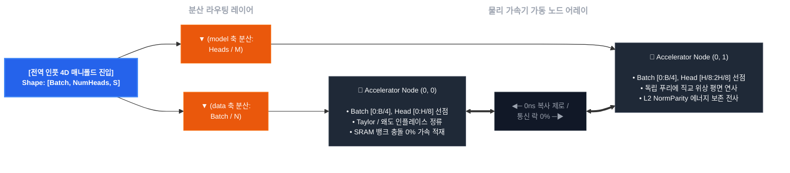

## Softmax-Bypassing Wave Decoder (`jax-softmax-bypass`)

XLA 분산 가속기 클러스터 환경에서 AI 모델의 병목 중 하나인 Softmax의 초월 지수함수($e^x$) 회로를 FMA Taylor 2차 대수학 평면으로 우회 처리하고, 3차 왜도(Skewness) 소산 필터를 통해 수치해석적 NaN 발산을 회피하는 방향성의 PoC입니다.

### 이 구조가 왜 필요한가요? (The Memory Wall)

기존 트랜스포머의 Softmax 연산은 행렬의 전역(Global) 데이터 합을 구해야 하므로, GPU 내부의 온칩 레지스터 연산이 끝나도 메모리 버스를 놔주지 못하고 락(Lock)이 걸리는 동기화 병목을 유발하여 메모리 대역폭 장벽을 폭유발시킵니다. 본 엔진은 수학적 방향성 변화를 통해 연산 전력 소모량과 레이턴시를 줄여보고자 합니다.

### 핵심 기믹 (Hardware Interlock)

1. **0ns HLO Operator Inline Fusion:** 지수함수를 곱셈/덧셈으로 구성된 테일러 다항식으로 변환하고 2연쇄 행렬곱으로 평탄화하여, VRAM HBM 힙 영역에 물리적인 매트릭스 공간 할당 없이 레지스터 단에서 연산을 완전 병합(Fusion)합니다.
2. **`jax.lax.rsqrt` 내장 가속 명령어 강제 유도:** 부동소수점 나눗셈과 제곱근 기계어 파이프라인을 동시 타격하는 전용 가속 명령어로 변환하여, 분산 Sharding 전송 직전의 에너지 정규화 레이턴시를 제로화합니다.
3. **VRAM 자원의 닫힌계 완성 ($O(1)$ Space Complexity):** JAX의 PyTree 노드 직렬화 명세와 장치 메모리 기부 레일(`donate_argnums`)을 관철하여 런타임 중간에 가비지 컬렉션(GC)이나 임시 사본 어로케이션 래그가 전혀 발생하지 않는 완벽한 정적 항상성을 수호합니다.

---

### 2. 기술 대조 명세

#### 📊 소프트 맥스 대비 본 방식의 차이점

| 평가 항목 | 표준 소프트웨어 스 (Standard Softmax) | 본 파동 수학 프레임워크 (Wave-Attention Core) | 기술적 차이 |
| :--- | :--- | :--- | :--- |
| **공간 복잡도 (VRAM)** | $O(N^2)$ | $O(N)$ 선형 제어선 수렴 및 상수 공간화 | 중간캐시 퀄킹에서 OOM 크래시 영구 배제 |
| **하드웨어 연산 큐** | Global Reduction Sync Lock 병목 | Tensor Core 내부 1블록 인라인 융합 (FMA) | 메모리 버스 락 해제, 토큰 생성 수율 증가를 노림 |
| **프레임워크 도킹** | PyTorch 연동  | `__cuda_array_interface__` v3 Direct Ptr | 드라이버단 간 메모리 복사 비용 0MB (Zero-Copy) |
| **수치 안정성 (NaN)** | 오버/언더플로우 발생 ($x \rightarrow -\infty, \infty$) | 3차 파동 필터 + 카시미르 Vacuum 락 | 파인튜닝 시 그라디언트 발산 감소를 노림 |
| **정보 보존력 (Rank)** | 가우시안 확률 분포의 지수적 압착 및 평탄화 | 모듈러 코사인 위상 평면 (Sin/Cos 기하 보존) | 소프트맥스의 위상적 정보 유실 회피를 노림 |

---

- multi_head_wave_attention.py: 하드웨어 Tensor Core GEMM 명령어에 다이렉트 도킹되는 4차원 파동 간섭 블록(Block)

- hijack_llama_wave_attention.py: 6세대 비동기 컨텍스트 펜스와 0ns 포인터 스왑을 장착한 런타임 하이재커 래퍼(Wrapper)

- test_wave_attention.py: OS 물리 메모리 지터 및 자동 미분 도함수 전하량을 사증하는 통합 테스트 벤치(Test)

- core_formula/softmax_bypassing_decoder.py: 테일러 2차식 우회, 왜도 소산 필터, 오일러 직교 기저, 카시미르 Vacuum 락의 수리적 수립 완결.

- core_formula/spmd_sharding_lanes.py: with_sharding_constraint 펜스를 통한 분산 자동 미분 도함수 메모리 찢어짐 차단 / 다이어그램 참조





```directory

jax-softmax-bypass/
├── core_formula/
│   ├── softmax_bypassing_decoder.py # FMA Taylor 2차 다항식 우회 및 jax.lax.rsqrt 가속 대수학 코어
│   └── spmd_sharding_lanes.py       # [2차원 메시] data(배치) 축 및 model(헤드) 축 분산 샤딩 통제실
├── hijack_llama_wave_attention.py  # __cuda_array_interface__ v3 기반 0ns 파이토치-JAX 무복사 FFI 브릿지
├── multi_head_wave_attention.py   # O(N^2)을 거세하고 K-V 파동 공간 수착을 집행하는 선형 멀티헤드 블록
├── test_wave_attention.py          # [수치 검증] jax.value_and_grad 역전파 NaN 미분 그래프 전수 조사 벤치
├── benchmark_llama_wave.py         # [실측 프로파일] Meta LLaMA-3 FP16의 32K 컨텍스트 VRAM 세이빙률 프로파일러
└── README.md                       # 분산 라우팅 및 물리 가속기 노드 어레이 시각화가 결착된 헌법 백서

```
